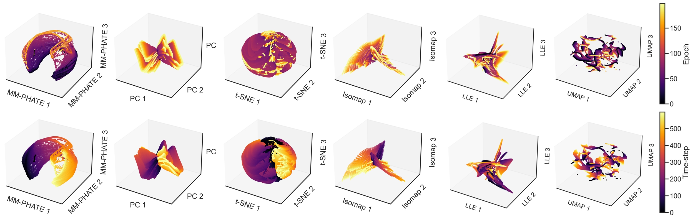

# MM-PHATE: Multiway Multislice PHATE

> Visualizing Hidden Dynamics of RNNs Through Training

---

## Overview

MM-PHATE (Multiway Multislice PHATE) is a novel dimensionality reduction framework designed to visualize and understand the internal dynamics of Recurrent Neural Networks (RNNs) throughout their training process.

Unlike standard visualization methods which only focus on the final network state, MM-PHATE captures how RNN hidden representations evolve over both time steps and training epochs, revealing rich dynamics, community structure, and phases of information processing and compression.

This repository contains code for implementing MM-PHATE on RNN hidden state data, along with examples and visualization utilities.

---

## Method at a Glance

MM-PHATE extends the M-PHATE framework originally developed by Gigante et al. to handle the temporal nature of RNNs.

Key components include:
- Multiway multislice kernel construction across epochs, time steps, and units
- Structured graph affinities within and across time and epochs
- PHATE embedding for visualization
- Entropy-based analysis of information flow within RNNs

---

## Visualization Examples



### Example 1: MM-PHATE vs PCA / t-SNE / Isomap


---

### Example 2: Tracking RNN Evolution Across Epochs


---

## Installation

```bash
git clone https://github.com/your_username/MM-PHATE.git
cd MM-PHATE
pip install -r requirements.txt
